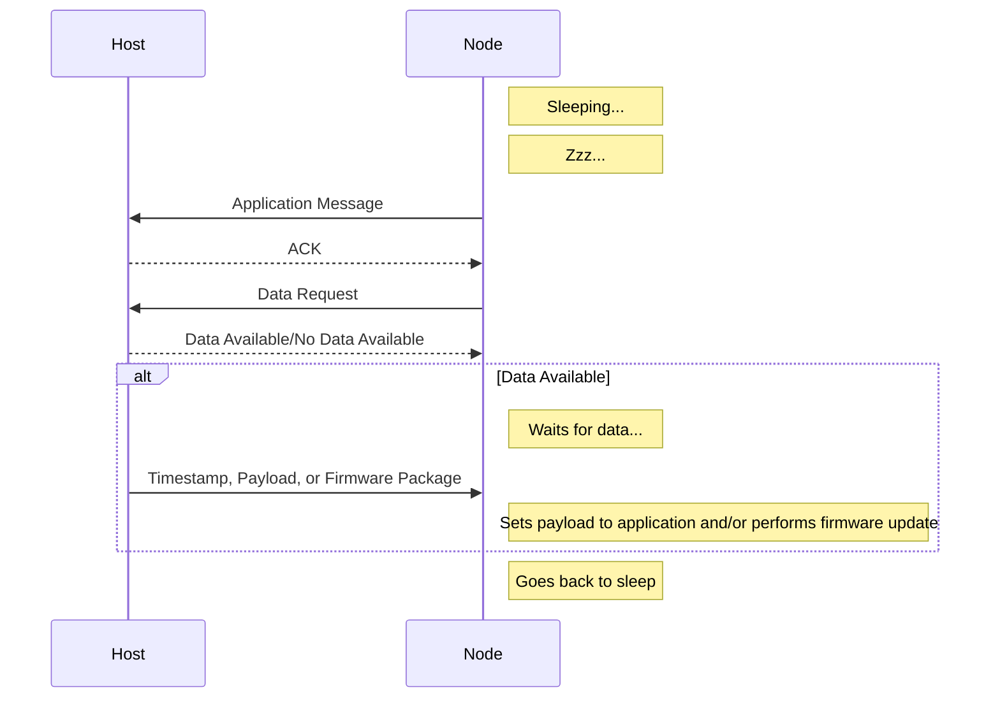

# IEEE 802.15.4 Network - Node
[](https://registry.platformio.org/libraries/johboh/ieee-802_15_4-network-node)
[](https://components.espressif.com/components/johboh/ieee-802_15_4-network-node)
[](https://downloads.arduino.cc/libraries/logs/github.com/Johboh/ieee-802_15_4-network-node/)
[](https://github.com/Johboh/ieee-802_15_4-network-node/releases)
[](https://github.com/Johboh/ieee-802_15_4-network-node)

### Summary
Arduino (using Arduino IDE) and ESP-IDF (using Espressif IoT Development Framework or PlatformIO) compatible libraries for setting up a network of IEEE 802.15.4 nodes that send data to a [host](https://github.com/Johboh/ieee-802_15_4-network-host). This is the node library; also see [the host library](https://github.com/Johboh/ieee-802_15_4-network-host).

### Usage/Purpose
The primary use case for the IEEE 802.15.4 Network is to run a network of battery-powered nodes with sensors, where the nodes sleep most of the time, and low power consumption is an important factor. Nodes wake up either due to an external interrupt (like a PIR sensor or switch) or periodically based on time. Upon waking up, they send their sensor values and go back to sleep. On the receiving side, there is an always-powered router board that receives the sensor values and acts on or forwards them for consumption elsewhere, such as MQTT and/or [Home Assistant](https://www.home-assistant.io).

### Features
- **Encryption**: Encryption and integrity using GCM (no protection for replay attacks currently).
- **Generic firmware**: For boards with the same hardware, the same firmware can be used for all of them. No unique ID needs to be programmed into each board/node.
- **Over The Air (OTA)**: A node can be updated over the air. Nodes report their firmware version upon handshake, and the host can send back Wi-Fi credentials and a URL where the new firmware can be downloaded. The node downloads the firmware, flashes it, and restarts.
- **Remote configuration**: The host can send configuration or other payloads to configure the nodes, such as setting the wakeup period or similar parameters.

### Package Flow and Challenge Requests


### Installation
#### PlatformIO using ESP-IDF framework (Arduino for PlatformIO not supported, see notes under [Compatibility](#compatibility)):
Copy the dependencies from [idf_component.yml](./idf_component.yml) to a new or existing `idf_component.yaml` in your `src` or `main` folder.

#### Arduino IDE:
Search for `ieee-802_15_4-network-node` by `johboh` in the library manager.

#### Espressif IoT Development Framework:
In your existing `idf_component.yml` or in a new `idf_component.yml` in your `main` folder:
```
dependencies:
  johboh/ieee-802_15_4-network-node:
    version: ">=0.7.0"
```

### Examples
- [Using Arduino IDE/CLI, sleeping node](examples/arduino/sleeping_node/sleeping_node.ino)
- [Using ESP-IDF framework/PlatformIO, sleeping node](examples/espidf/sleeping_node/main/main.cpp)

### Compatibility
- Currently, ESP32-C6 and ESP32-H2 are the only devices supporting 802.15.4, but more may be supported in the future.
- Requires at least ESP-IDF 5.1.0.
- Can be used as an Arduino library when using the Arduino IDE or the ESP-IDF framework with the Arduino core.
- Can be used as an ESP-IDF component when using the ESP-IDF framework.
- For PlatformIO, it can only be used with the ESP-IDF framework, as the PlatformIO Arduino version (4.4.7) is too old (end of life).