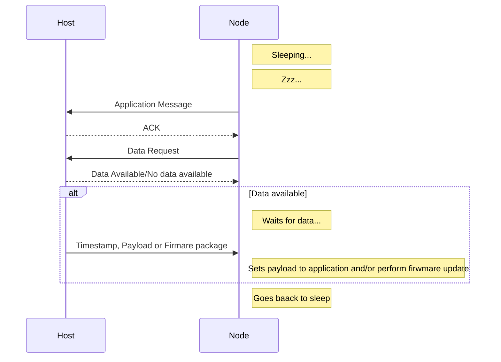

# Ieee 802.15.4 Network - Node
[](https://registry.platformio.org/libraries/johboh/ieee-802_15_4-network-node)
[](https://components.espressif.com/components/johboh/ieee-802_15_4-network-node)
[](https://github.com/Johboh/ieee-802_15_4-network-node/actions/workflows/arduino_cli.yaml)
[](https://github.com/Johboh/ieee-802_15_4-network-node/releases)
[](https://github.com/Johboh/ieee-802_15_4-network-node)

### Summary
Arduino (using Arduino IDE) and ESP-IDF (using Espressif IoT Development Framework or PlatformIO) compatible libraries for setting up a network of IEEE 802.15.4 nodes.

Also see [the library to use on the host](https://github.com/Johboh/ieee-802_15_4-network-host)

### Usage/Purpose
The prmary use case for the Ieee 802.15.4 Network is to run a network of battery powered nodes with sensors, where the nodes will sleep most of the time and low power consumption is an important factor. Nodes will wake up either due to external interrupt (like a PIR sensor or switch) or perodically based on time. Upon wakeup, they will send their sensors values and go back to sleep. On the receiving side, there is a always powered router board that will receive the sensor values and act on or forward them for consumption somewhere else, like MQTT and/or [Home Assistant](https://www.home-assistant.io).

### Features
- **Encryption**: Encryption and integrity using GCM (no protection for replay attacks currently)
- **Generic firmware**: For boards that do the same thing (e.g. they have the same hardware), the same firmware can be used for all of them. No unique ID is required to be programmed into each board/node.
- **Over The Air/OTA**: A node can be updated Over The Air. The node report their firmware version upon handsake, and the host can send back wifi credentials and an URL where to download the new firmware. The node will download the firmware, flash it and restart.
- **Remote configuration**: The host can send configuration or other payload to configure the nodes, like setting wakeup period or similar.

### Package flow and challenge requests


### Installation
#### PlatformIO (Arduino or ESP-IDF):
Add the following to `libs_deps`:
```
   Johboh/ieee-802_15_4-network-node
```
#### Arduino IDE:
Search for `ieee-802_15_4-network-node` by `johboh` in the library manager.
#### Espressif IoT Development Framework:
In your existing `idf_component.yml` or in a new `idf_component.yml` next to your main component:
```
dependencies:
  johboh/ieee-802_15_4-network-node:
    version: ">=0.7.0"
```

#### Arduino IDE:
Search for `ieee-802_15_4-network-node` by `johboh` in the library manager. See note about version above.

### Examples
- [Using Arduino IDE/CLI, sleeping node](examples/arduino/sleeping_node/sleeping_node.ino)
- [Using ESP-IDF framework/PlatformIO, sleeping node](examples/espidf/sleeping_node/main/main.cpp)

### Compatibility
- As of now, ESP32-C6 and ESP32-H2 are the only ones supporting 802.15.4, but might be more in the future.
- Requires at last ESP-IDF 5.1.0
- Can be uses as an Arduino library when using Arduino IDE, or the ESP-IDF framework with Arduino core.
- Can be used as an ESP-IDF component when using ESP-IDF framework.
- For PlatformIO, can only be used when using the ESP-IDF framework, as PlatformIO Arduino verion is too old (4.4.7, end of life))
